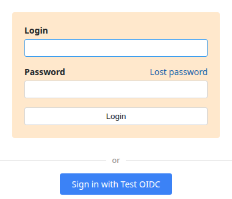
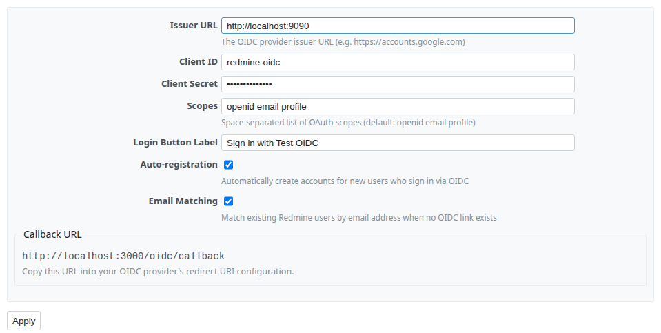
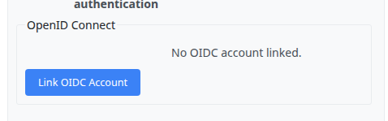
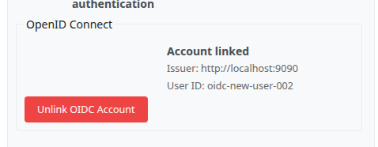
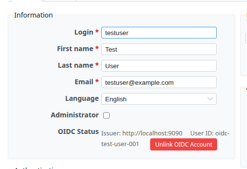

# Redmine OIDC

OpenID Connect single sign-on plugin for Redmine. Works with any OIDC-compliant identity provider including Google, Microsoft Entra ID, Okta, Keycloak, and others.

## Features

- **SSO login** -- adds a configurable "Sign in with ..." button to the Redmine login page
- **Self-service account linking** -- users can link their own OIDC identity from My Account, even if their OIDC email differs from their Redmine email
- **Conflict detection** -- if an OIDC identity is already linked to another Redmine user, linking is rejected
- **Auto-registration** -- optionally create Redmine accounts on first OIDC login
- **Email matching** -- optionally match existing Redmine users by email when no OIDC link exists (login flow only)
- **Admin OIDC management** -- admins can view and remove OIDC links from the user edit page
- **Multiple link support** -- correctly handles users with multiple OIDC links (e.g. after a provider change)
- **Standard flow** -- uses the Authorization Code flow with OIDC Discovery

## Screenshots

### Login page



### Plugin settings



### My Account -- not linked

Users see a "Link OIDC Account" button to initiate self-service linking.



### My Account -- linked OIDC identity

After linking, the issuer and user ID are shown with an option to unlink.



### Admin user edit -- OIDC status and unlink



## Requirements

- Redmine 5.0+ or 6.0+
- Ruby 2.7+
- OIDC provider that supports Discovery (`/.well-known/openid-configuration`)

No additional gem dependencies are required. The plugin uses Ruby's built-in `net/http` for all HTTP requests.

## Compatibility

| Plugin Version | Redmine    | Ruby  | Rails       |
|----------------|------------|-------|-------------|
| 1.0.0          | 5.x / 6.x | 2.7+  | 6.1+ / 8.x |

Tested with Redmine 5.1 (Rails 6.1) and Redmine 6.0 (Rails 8.1).

## Installation

1. Clone or copy the plugin into your Redmine plugins directory:

   ```bash
   cd /path/to/redmine/plugins
   git clone https://github.com/enricohuang/redmine_oidc.git
   ```

2. Run the plugin migration:

   ```bash
   cd /path/to/redmine
   bundle exec rake redmine:plugins:migrate RAILS_ENV=production
   ```

3. Restart Redmine.

## Configuration

Go to **Administration > Plugins > Redmine OIDC > Configure** and fill in:

| Setting | Description |
|---------|-------------|
| **Issuer URL** | Your OIDC provider's issuer URL (e.g. `https://accounts.google.com`). The plugin uses OIDC Discovery (`/.well-known/openid-configuration`) to find all endpoints automatically. |
| **Client ID** | The OAuth client identifier registered with your provider. |
| **Client Secret** | The OAuth client secret. |
| **Scopes** | Space-separated scopes (default: `openid email profile`). |
| **Login Button Label** | Text shown on the SSO button on the login page. |
| **Auto-registration** | When enabled, new Redmine accounts are created automatically on first OIDC login. |
| **Email Matching** | When enabled, existing Redmine users are matched by email address if no OIDC link exists. |

### Callback URL

The settings page displays your Callback URL at the bottom. Register this URL as a redirect URI in your OIDC provider's client configuration:

```
https://your-redmine.example.com/oidc/callback
```

### Provider-specific examples

<details>
<summary>Google</summary>

1. Go to [Google Cloud Console](https://console.cloud.google.com/) > APIs & Services > Credentials
2. Create an OAuth 2.0 Client ID (Web application)
3. Add your callback URL as an Authorized redirect URI
4. In plugin settings, set Issuer URL to `https://accounts.google.com`

</details>

<details>
<summary>Microsoft Entra ID (Azure AD)</summary>

1. Go to Azure Portal > App registrations > New registration
2. Add your callback URL as a Redirect URI (Web platform)
3. In plugin settings, set Issuer URL to `https://login.microsoftonline.com/{tenant-id}/v2.0`

</details>

<details>
<summary>Keycloak</summary>

1. Create a client in your Keycloak realm with Access Type: confidential
2. Add your callback URL as a Valid Redirect URI
3. In plugin settings, set Issuer URL to `https://keycloak.example.com/realms/{realm}`

</details>

## How It Works

### Login flow

1. User clicks the SSO button on the login page
2. Browser redirects to the OIDC provider's authorization endpoint
3. User authenticates with the provider
4. Provider redirects back to `/oidc/callback` with an authorization code
5. Plugin exchanges the code for tokens, fetches userinfo, and logs the user in

### User matching (in order)

These steps apply during the login flow when an unauthenticated user clicks the SSO button:

1. **OIDC link lookup** -- match by issuer + subject ID (`sub` claim)
2. **Email matching** -- if enabled, match by email address and auto-create a link
3. **Auto-registration** -- if enabled, create a new Redmine user from the OIDC profile

### Self-service account linking

Users can link their OIDC identity themselves from **My Account > OpenID Connect > Link OIDC Account**. Clicking the button redirects them to the OIDC provider to authenticate. On successful authentication, the plugin creates a link between their Redmine account and their OIDC subject ID.

Key behaviors:

- The OIDC email does not need to match the user's Redmine email. Linking is based solely on the OIDC subject identifier (`sub` claim), not email.
- If the OIDC identity is already linked to a different Redmine user, the operation fails with an error message ("This OIDC account is already linked to another user."). This prevents two Redmine accounts from sharing the same SSO identity.
- Users can unlink their OIDC identity from My Account at any time.

### Provider change -- orphaned links

When an admin changes the OIDC provider (updates the Issuer URL in plugin settings), existing links to the old provider become orphaned. The plugin handles this gracefully for both users and admins:

- **My Account page** -- The plugin compares each user's links against the current Issuer URL. If the user has no link to the current provider, the "Link OIDC Account" button is shown so they can self-link to the new provider. Any old orphaned links are still displayed with their Unlink buttons, so the user can clean them up.
- **Admin user edit page** -- Admins can see all OIDC links (current and orphaned) for any user under **Administration > Users > Edit**, and remove stale links without requiring the user to do it themselves.

## Uninstallation

1. Run the plugin migration rollback:

   ```bash
   cd /path/to/redmine
   bundle exec rake redmine:plugins:migrate NAME=redmine_oidc VERSION=0 RAILS_ENV=production
   ```

2. Remove the plugin directory:

   ```bash
   rm -rf plugins/redmine_oidc
   ```

3. Restart Redmine.

## License

MIT License. See [LICENSE](LICENSE) for details.
